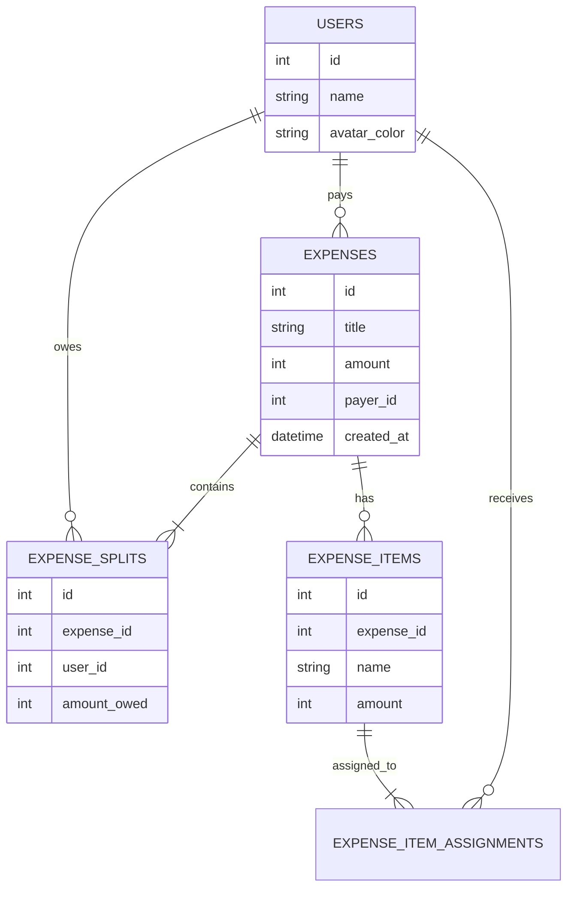
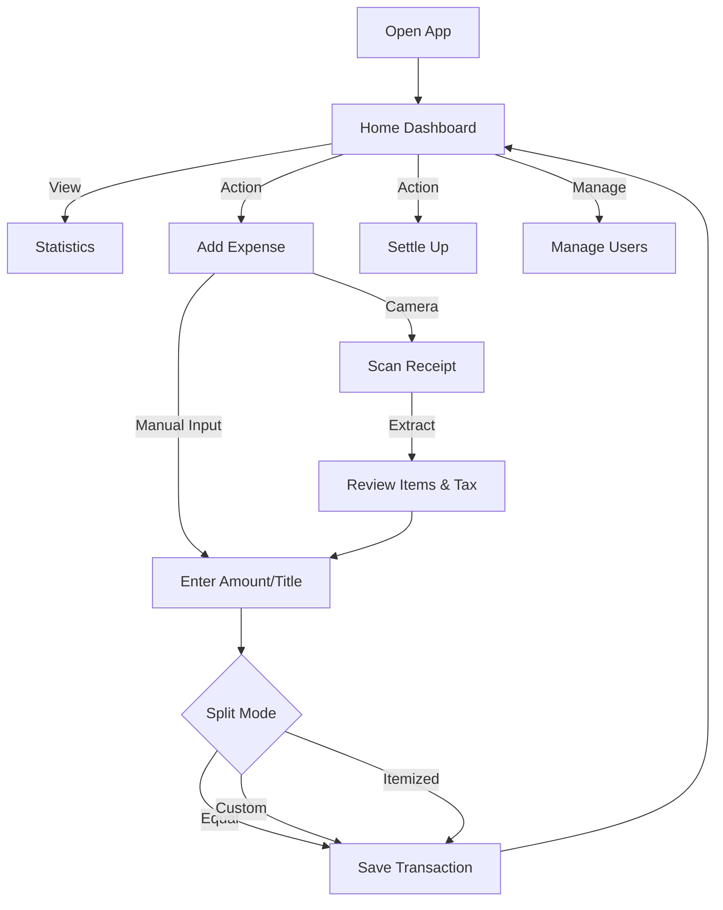
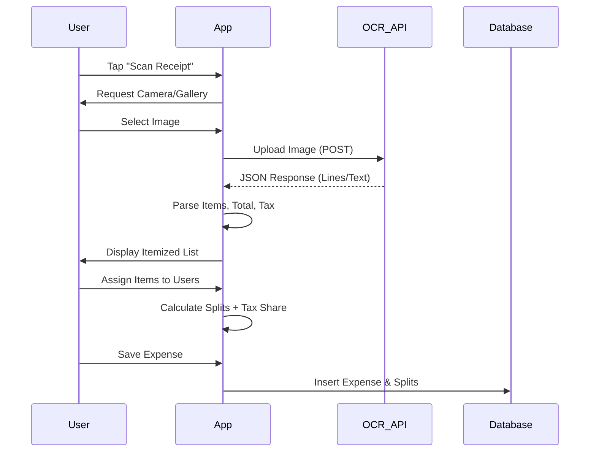

# FairShare Project Documentation

## 1. Executive Summary
**FairShare** is a mobile expense splitting application designed to simplify shared financial responsibilities among friends, roommates, and travel groups. Built with **React Native (Expo)**, it offers an offline-first experience with a focus on speed, privacy, and ease of use. The app allows users to track shared expenses, split bills using various methods (Equal, Custom, Percentage, Shares, Itemized), and settle debts efficiently.

---

## 2. Key Features

### 💰 Expense Tracking
- **Quick Entry**: Add expenses in seconds with a streamlined UI.
- **Flexible Splitting**:
  - **Equal**: Split evenly among selected members.
  - **Custom**: Assign specific amounts to each person.
  - **Percentage**: Distribute costs by percentage (e.g., 60/40).
  - **Shares**: Allocate based on units (e.g., Alice had 2 drinks, Bob had 1).
  - **Itemized**: Scan receipts and assign specific line items to individuals.

### 🧾 Smart Receipt Scanning (OCR)
- Integrated **OCR.space API** to digitize physical receipts.
- **Automated Parsing**: Detects merchant name, total amount, and line items.
- **Tax & Service Charge**: Automatically identifies and applies tax/service charges proportionally to users based on their assigned items.

### 👥 User & Group Management
- **Manage Users**: Add, rename, or remove users dynamically.
- **Avatars**: Auto-generated colored avatars for easy identification.
- **Group Statistics**: Visual leaderboard showing "Who spent the most" and spending distribution.

### ⚖️ Debt Settlement
- **Simplified Debts**: Calculates the minimum number of transactions required to settle up using an optimized algorithm.
- **Shareable Summaries**: Generate text reports of who owes whom to share via WhatsApp, Telegram, or other messaging apps.

---

## 3. Technical Architecture

### Tech Stack
- **Framework**: React Native (Expo SDK 54)
- **Language**: TypeScript
- **Styling**: NativeWind (Tailwind CSS for React Native)
- **Database**: `expo-sqlite` (Local, offline-first SQL database)
- **Navigation**: `expo-router` (File-based routing)
- **Image/OCR**: `expo-image-picker`, `expo-image`, REST API fetch

### Data Model (SQLite)

### Algorithm Highlights
- **Split Logic**: Handles rounding errors (cents) by distributing remainders to ensure the sum always matches the total.
- **Debt Simplification**: Instead of A paying B, and B paying C, the app calculates the net flow so A pays C directly if applicable, reducing total transaction count.

---

## 4. User Workflow

### App Navigation Flow

### Receipt Scanning Process

1.  **Home Dashboard**: View total group spending, recent activity, and quick actions.
2.  **Add Expense**: 
    - Enter amount manually or scan a receipt.
    - Select who paid and who splits.
    - Choose split mode (Equal, Itemized, etc.).
3.  **Settle Up**: 
    - View the "Balances" tab to see net standing.
    - Check "Suggested Payments" for the efficient settlement plan.
    - Share the settlement plan with the group.

---

## 5. Future Roadmap
- [ ] **Multi-Currency Support**: Handle international travel expenses with exchange rates.
- [ ] **Cloud Sync**: Optional cloud backup for multi-device access.
- [ ] **Export Options**: Export data to CSV/Excel for detailed analysis.
- [ ] **Multiple Groups**: Support for distinct groups (e.g., "Trip to Japan", "House Rent").
